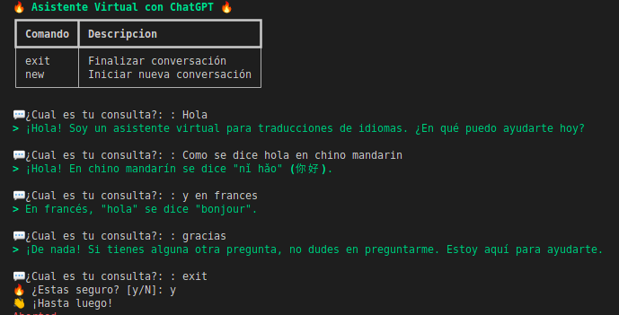
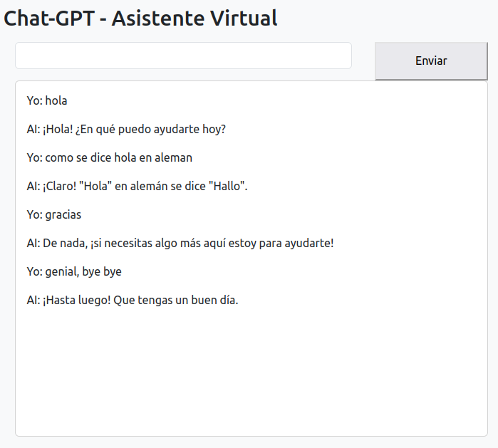

# Chat-GPT API with Python

Create chatbot using ChatGPT.

1. **Set up environment**

    a. Create conda environment
    ```bash
    conda create -n openai python=3.9
    ```
    b. Install dependecies, typer for a better design in terminal
    ```bash
    pip install openai
    pip install "typer[all]"
    pip install Flask
    ```
2. **OPENAI credentials**
    
    I did not include the credentials script, so you have to create it
        
    *credentials.py*
    ```python 
    OPENAI_API_KEY = 'xxxxxxxxxxxxxxxxxxxxxxxxxxx'
    OPENAI_ORG_ID = 'xxxxxxxxxxxxxxxxxxxxxxxxxx'  
    ```

3. **ChatGPT in terminal**

    Run:
    ```bash
    python main.py
    ```

    

4. **ChatGPT + Flask local deploy**

    * Go inside to `chat-app` file
    * Run
        ```bash
        python app.py
        ```
    


